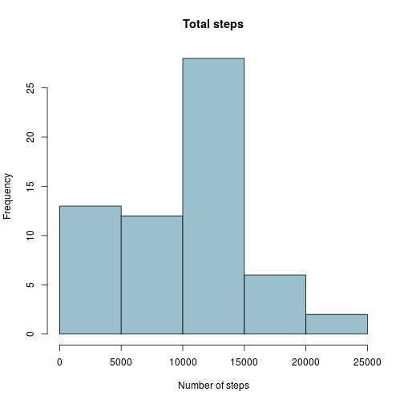

# Reproducible Research: Peer Assessment 1
This file is the solution of the assignment


## Required libraries

```r
# Load required libraries
suppressPackageStartupMessages(library("dplyr"))
suppressPackageStartupMessages(library("data.table"))
```

## Loading and preprocessing the data

```r
# Input files
file.zip <- "activity.zip"
file.csv <- "activity.csv"

# Load and process the data
dat <- unz(file.zip, file.csv) %>%
       read.csv(as.is = TRUE,
                colClasses = c("integer", "Date", "integer"),
                check.names = FALSE) %>%
       data.table %>%
       setkey(date, interval)

# Print data summary
summary(dat)
```

```
##      steps             date               interval     
##  Min.   :  0.00   Min.   :2012-10-01   Min.   :   0.0  
##  1st Qu.:  0.00   1st Qu.:2012-10-16   1st Qu.: 588.8  
##  Median :  0.00   Median :2012-10-31   Median :1177.5  
##  Mean   : 37.38   Mean   :2012-10-31   Mean   :1177.5  
##  3rd Qu.: 12.00   3rd Qu.:2012-11-15   3rd Qu.:1766.2  
##  Max.   :806.00   Max.   :2012-11-30   Max.   :2355.0  
##  NA's   :2304
```


## What is mean total number of steps taken per day?

```r
# Calculate the total number of steps taken per day
totalsteps <- dat[, sum(steps, na.rm = TRUE), by = date][,V1]

# Plot histogram of the total number of steps taken each day
hist(totalsteps,
     main = "Total steps",
     xlab = "Number of steps",
     col = "red")
```

 

```r
# Calculate the mean and median of the total number of steps taken per day
mean(totalsteps)
```

```
## [1] 9354.23
```

```r
median(totalsteps)
```

```
## [1] 10395
```


## What is the average daily activity pattern?


## Imputing missing values


## Are there differences in activity patterns between weekdays and weekends?
