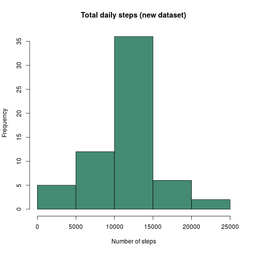
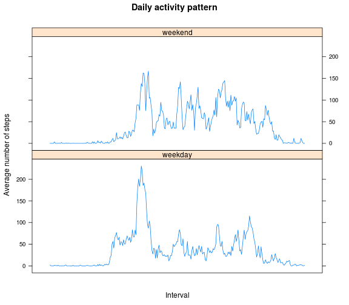

# Reproducible Research: Peer Assessment 1
This file is the solution of the assignment.


## Required libraries
Load the necessary libraries in order to perform the analysis.


```r
# Load required libraries
suppressPackageStartupMessages(library("dplyr"))
suppressPackageStartupMessages(library("data.table"))
suppressPackageStartupMessages(library("lattice"))
```

## Loading and preprocessing the data
* Load the data

Only the original file *activity.zip* is expected to exist
in the current folder.

Please note that we must treat the *interval*
variable as time, otherwise our plots would be wrong.
In its internal storage, R needs a complete date, so it is
considered as today (but not relevant to the analysis).
For more information, please refer to these threads: 
[[1]](https://class.coursera.org/repdata-036/forum/thread?thread_id=29)
[[2]](https://class.coursera.org/repdata-036/forum/thread?thread_id=22).


```r
# Input files
file.zip <- "activity.zip"
file.csv <- "activity.csv"

# Load and process the data
dat <- unz(file.zip, file.csv) %>%
       read.csv(as.is = TRUE,
                colClasses = c("numeric", "Date", "integer"),
                check.names = FALSE) %>%
       data.table

# Additional processing for interval variable
time <- as.POSIXct(sprintf("%04d", dat$interval), format = "%H%M", tz = "GMT")
dat[, interval:=NULL][, interval:=time] %>% setkey(interval)

# Print data summaries
str(dat)
```

```
## Classes 'data.table' and 'data.frame':	17568 obs. of  3 variables:
##  $ steps   : num  NA 0 0 47 0 0 0 NA 0 34 ...
##  $ date    : Date, format: "2012-10-01" "2012-10-02" ...
##  $ interval: POSIXct, format: "2015-07-10 00:00:00" "2015-07-10 00:00:00" ...
##  - attr(*, ".internal.selfref")=<externalptr> 
##  - attr(*, "sorted")= chr "interval"
```

```r
summary(dat)
```

```
##      steps             date               interval                  
##  Min.   :  0.00   Min.   :2012-10-01   Min.   :2015-07-10 00:00:00  
##  1st Qu.:  0.00   1st Qu.:2012-10-16   1st Qu.:2015-07-10 05:58:45  
##  Median :  0.00   Median :2012-10-31   Median :2015-07-10 11:57:30  
##  Mean   : 37.38   Mean   :2012-10-31   Mean   :2015-07-10 11:57:30  
##  3rd Qu.: 12.00   3rd Qu.:2012-11-15   3rd Qu.:2015-07-10 17:56:15  
##  Max.   :806.00   Max.   :2012-11-30   Max.   :2015-07-10 23:55:00  
##  NA's   :2304
```


## What is mean total number of steps taken per day?
* Calculate the total number of steps taken per day

```r
# Calculate the total number of steps taken per day
steps.date <- dat[, sum(steps, na.rm = TRUE), by = date][, V1]
```

* Make a histogram of the total number of steps taken each day

```r
# Plot histogram of the total number of steps taken each day
hist(steps.date,
     main = "Total daily steps",
     xlab = "Number of steps",
     col  = "lightblue3")
```

 

* Calculate and report the mean and median of the total number of steps taken per day

```r
# Calculate the mean and median of the total number of steps taken per day
mean(steps.date)
```

```
## [1] 9354.23
```

```r
median(steps.date)
```

```
## [1] 10395
```


## What is the average daily activity pattern?
* Make a time series plot of the 5-minute interval (x-axis) and the average
number of steps taken, averaged across all days (y-axis)

```r
# Calculate the average number of steps taken, averaged across all days
steps.interval <- dat[, mean(steps, na.rm = TRUE), by = interval]

# Plot daily activity pattern
with(steps.interval, plot(V1 ~ interval,
                          type = "l",
                          main = "Daily activity pattern",
                          ylab = "Average number of steps",
                          xlab = "Interval",
                          col  = "red4"))
```

 
* Which 5-minute interval, on average across all the days in the dataset,
contains the maximum number of steps?

```r
# Find interval with maximum number of steps
format(steps.interval[which.max(V1), interval], "%H:%M")
```

```
## [1] "08:35"
```


## Imputing missing values
* Calculate and report the total number of missing values in the dataset

```r
# Calculate the total number of missing values in the dataset
sum(is.na(dat))
```

```
## [1] 2304
```
* (i.e. the total number of rows with NAs)

Please note that this a different question
(even though, in this case, the answer is the same).

```r
# Calculate the total number of rows with NAs
sum(! complete.cases(dat))
```

```
## [1] 2304
```

* Devise a strategy for filling in all of the missing values in the dataset.
* Create a new dataset that is equal to the original dataset but with the
missing data filled in.

The adopted strategy is to fill in missing values with the mean for the
respective interval.

```r
# New dataset with the missing data filled in (the mean for each interval)
dat <- dat[steps.interval][is.na(steps), steps:=V1][, V1:=NULL]
```

* Make a histogram of the total number of steps taken each day.

```r
# Calculate the total number of steps taken per day
steps.date <- dat[, sum(steps), by = date][, V1]

# Plot histogram of the total number of steps taken each day
hist(steps.date,
     main = "Total daily steps (new dataset)",
     xlab = "Number of steps",
     col  = "aquamarine4")
```

 

* Calculate and report the mean and median total number of steps taken per day.

```r
# Calculate the mean and median of the total number of steps taken per day
mean(steps.date)
```

```
## [1] 10766.19
```

```r
median(steps.date)
```

```
## [1] 10766.19
```

* Do these values differ from the estimates from the first part of
the assignment?
What is the impact of imputing missing data on the estimates of the total
daily number of steps?

Yes, they differ. 
Previously, missing values were ignored and, this way, they accounted for zero step. In the new dataset, missing values were replaced by the mean of the respective interval and, therefore, the number of total steps increased. More noticeably, the group ranging between 0 and 5000 steps has a lower frequency, while the group ranging between 10000 and 15000 has a higher frequency.

## Are there differences in activity patterns between weekdays and weekends?
* Create a new factor variable in the dataset with two levels

```r
# Create a new factor “weekday” and “weekend"
dat <- dat[, day:=factor(weekdays(date) %in% c("Saturday", "Sunday"),
                         labels = c("weekday", "weekend"))]
```

* Make a panel plot containing a time series plot of the 5-minute
interval (x-axis) and the average number of steps taken, averaged
across all weekday days or weekend days (y-axis).

Again, please ignore the date in the *interval* variable.


```r
# Calculate
steps.day <- dat[, mean(steps), by = list(interval, day)]

# Make a panel plot
with(steps.day, xyplot(V1 ~ interval | day,
                       type = "l",
                       scales=list(x=list(at=NULL)),
                       layout = c(1,2),
                       main = "Daily activity pattern",
                       ylab = "Average number of steps",
                       xlab = "Interval"))
```

 

