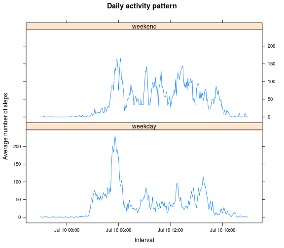

# Reproducible Research: Peer Assessment 1
This file is the solution of the assignment


## Required libraries

```r
# Load required libraries
suppressPackageStartupMessages(library("dplyr"))
suppressPackageStartupMessages(library("data.table"))
suppressPackageStartupMessages(library("lattice"))
```

## Loading and preprocessing the data

```r
# Input files
file.zip <- "activity.zip"
file.csv <- "activity.csv"

# Load and process the data
dat <- unz(file.zip, file.csv) %>%
       read.csv(as.is = TRUE,
                colClasses = c("numeric", "Date", "integer"),
                check.names = FALSE) %>%
       data.table %>%
       setkey(interval)

# Print data summaries
str(dat)
```

```
## Classes 'data.table' and 'data.frame':	17568 obs. of  3 variables:
##  $ steps   : num  NA 0 0 47 0 0 0 NA 0 34 ...
##  $ date    : Date, format: "2012-10-01" "2012-10-02" ...
##  $ interval: int  0 0 0 0 0 0 0 0 0 0 ...
##  - attr(*, ".internal.selfref")=<externalptr> 
##  - attr(*, "sorted")= chr "interval"
```

```r
summary(dat)
```

```
##      steps             date               interval     
##  Min.   :  0.00   Min.   :2012-10-01   Min.   :   0.0  
##  1st Qu.:  0.00   1st Qu.:2012-10-16   1st Qu.: 588.8  
##  Median :  0.00   Median :2012-10-31   Median :1177.5  
##  Mean   : 37.38   Mean   :2012-10-31   Mean   :1177.5  
##  3rd Qu.: 12.00   3rd Qu.:2012-11-15   3rd Qu.:1766.2  
##  Max.   :806.00   Max.   :2012-11-30   Max.   :2355.0  
##  NA's   :2304
```


## What is mean total number of steps taken per day?

```r
# Calculate the total number of steps taken per day
steps.date <- dat[, sum(steps, na.rm = TRUE), by = date][, V1]

# Plot histogram of the total number of steps taken each day
hist(steps.date,
     main = "Total daily steps",
     xlab = "Number of steps",
     col  = "lightblue3")
```

 

```r
# Calculate the mean and median of the total number of steps taken per day
mean(steps.date)
```

```
## [1] 9354.23
```

```r
median(steps.date)
```

```
## [1] 10395
```


## What is the average daily activity pattern?

```r
# Calculate the average number of steps taken, averaged across all days
steps.interval <- dat[, mean(steps, na.rm = TRUE), by = interval]

# Plot daily activity pattern
with(steps.interval, plot(V1 ~ interval,
                          type = "l",
                          main = "Daily activity pattern",
                          ylab = "Average number of steps",
                          xlab = "Interval",
                          col  = "red4"))
```

 

```r
# Find interval with maximum number of steps
steps.interval[which.max(V1), interval]
```

```
## [1] 835
```


## Imputing missing values

```r
# Calculate the total number of missing values in the dataset
sum(is.na(dat))
```

```
## [1] 2304
```

```r
# Calculate the total number of rows with NAs
sum(! complete.cases(dat))
```

```
## [1] 2304
```

```r
# New dataset with the missing data filled in (the mean for each interval)
dat <- dat[steps.interval][is.na(steps), steps:=V1][, V1:=NULL]

# Calculate the total number of steps taken per day
steps.date <- dat[, sum(steps, na.rm = TRUE), by = date][, V1]

# Plot histogram of the total number of steps taken each day
hist(steps.date,
     main = "Total daily steps (new dataset)",
     xlab = "Number of steps",
     col  = "aquamarine4")
```

 

```r
# Calculate the mean and median of the total number of steps taken per day
mean(steps.date)
```

```
## [1] 10766.19
```

```r
median(steps.date)
```

```
## [1] 10766.19
```

##### Do these values differ from the estimates from the first part of the assignment? What is the impact of imputing missing data on the estimates of the total daily number of steps?
Yes, they differ. 
Previously, missing values were ignored and, this way, they accounted for zero step. In the new dataset, missing values were replaced by the mean of the respective interval and, therefore, the number of total steps increased. More noticeably, the group ranging between 0 and 5000 steps has a lower frequency, while the group ranging between 10000 and 15000 has a higher frequency.

## Are there differences in activity patterns between weekdays and weekends?

```r
# Create a new factor “weekday” and “weekend"
dat <- dat[, day:=factor(weekdays(date) %in% c("Saturday", "Sunday"),
                         labels = c("weekday", "weekend"))]
steps.day <- dat[, mean(steps), by = list(interval, day)]

# Make a panel plot
with(steps.day, xyplot(V1 ~ interval | day,
                       type = "l",
                       layout = c(1,2),
                       main = "Daily activity pattern",
                       ylab = "Average number of steps",
                       xlab = "Interval"))
```

 


